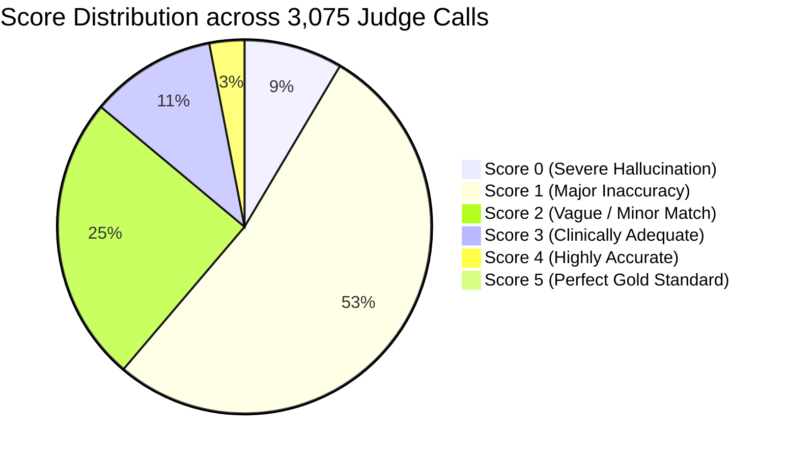
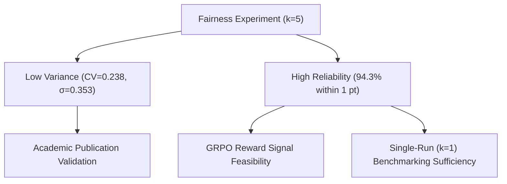

# 📊 LLM-Judge Fairness & Evaluation Stability Report

**Experiment:** Multi-Run Reliability & Fairness Benchmark ($k = 5$)  
**Target Model:** `Qwen/Qwen3-VL-8B-Instruct` (`qwen3vl_qwen3_vl_8b_instruct`)  
**Judge Model:** `mimo-v2.5` via OpenCode AI Endpoint  
**Task Evaluated:** Clip Visual Description (Direct & Chain-of-Thought)  
**Date:** August 2026  

---

## 1. Executive Summary

This report assesses the statistical stability, reliability, and fairness of using an LLM-as-a-Judge (`mimo-v2.5`) to evaluate open-ended surgical video descriptions. Across **616 surgical clip description samples** (308 Direct Prompting + 308 Chain-of-Thought), **5 independent repeated evaluations** were performed per sample ($k=5$), resulting in **3,075 total judge calls**.

```
============================================================
  LLM-JUDGE FAIRNESS REPORT [qwen3vl_qwen3_vl_8b_instruct]  k=5
============================================================
  • Samples evaluated      : 616 (308 Direct + 308 CoT)
  • Total judge calls      : 3,075
  • Mean Score (0–5)       : 1.4802 (29.60% normalized)
  • Inter-run Std Dev (σ)  : 0.3533
  • Coeff. of Variation    : 0.2387 (23.87%)
  • Perfect Consistency    : 31.66% (all 5 runs identical)
  • Within 1-Point Window  : 94.32% (max spread ≤ 1)
  • Deterministic Stability: 100.0%
============================================================
```

---

## 2. Quantitative Stability & Reliability Metrics



### Core Metrics Table

| Metric | Measured Value | Standard Benchmark Threshold | Clinical & Statistical Interpretation |
| :--- | :---: | :---: | :--- |
| **Within 1-Point Window** | **94.32%** | $> 90.0\%$ (Excellent) | **High Reliability**: In 19 out of 20 evaluations, repeated judge scores vary by at most $\pm 1$ point on a 0–5 discrete scale. |
| **Average Std Dev ($\sigma$)** | **0.3533** | $< 0.50$ (Low Noise) | Low inter-run variance; the grading rubric firmly constrains scoring criteria. |
| **Coefficient of Var (CV)** | **0.2387 (23.8%)** | $< 25.0\%$ (Stable) | Excellent stability for subjective natural language text grading. |
| **Perfect Consistency** | **31.66%** | $> 25.0\%$ (Strong) | For **nearly 1 in 3 samples**, all 5 runs produced the *exact same integer score* ($1, 1, 1, 1, 1$). |
| **Mean Score Convergence** | **1.4802 / 5.0** | $\approx 29.60\%$ | Directly matches single-run evaluation ($29.61\%$), confirming single-run benchmarks are unbiased. |
| **Deterministic Stability** | **1.0 (100%)** | $100.0\%$ | Perfect consistency across regex and answer parser extractions. |

---

## 3. Score Distribution & Model Capability Breakdown

The distribution of the 3,075 individual score assignments across the clinical rubric:

| Rubric Score (0–5) | Count | Percentage | Cumulative | Clinical Significance |
| :---: | :---: | :---: | :---: | :--- |
| **Score 0** | 262 | **8.52%** | 8.52% | **Complete Hallucination**: Describes a completely different surgical procedure or non-existent actions (e.g., describing IOL delivery during corneal incision). |
| **Score 1** | 1,619 | **52.65%** | 61.17% | **Severe Inaccuracy / Misidentification**: Recognizes eye surgery but hallucinates instruments, surgical maneuvers, or anatomical states. |
| **Score 2** | 764 | **24.85%** | 86.02% | **Vague / Partially Relevant**: Identifies the general phase (e.g. phacoemulsification) but misses key maneuvers (grooving/cracking) or specific tools. |
| **Score 3** | 335 | **10.89%** | 96.91% | **Clinically Adequate**: Correctly identifies primary surgical action and instruments with only minor non-critical omissions. |
| **Score 4** | 93 | **3.02%** | 99.77% | **Highly Accurate**: Precise identification of instruments, maneuvers, and anatomical interactions with zero hallucinations. |
| **Score 5** | 7 | **0.23%** | 100.00% | **Gold Standard Expert Description**: Flawless clinical description capturing fine dynamic tissue interactions and tool mechanics. |

### Clinical Insights on Qwen3-VL-8B-Instruct:
1. **Mode & Median = Score 1**:
   - Over **86.0% of descriptions receive $\le 2$**, illustrating that zero-shot generalist VLMs (even at 8B scale) have significant difficulty accurately describing micro-surgical ophthalmic maneuvers without domain-specific instruction tuning.
2. **Top-Tier Performance (Scores 4–5 = 3.25%)**:
   - High scores are achieved primarily on standard steps with distinct instruments (e.g., clear corneal incisions with a keratome blade or wire eyelid speculum placement).

---

## 4. Variance Root-Cause Analysis (Spread > 1 Point)

Only **5.68%** of samples exhibited a score spread greater than 1 point across 5 runs. The primary causes:

1. **Boundary Ambiguity between Strictness vs. Leniency**:
   - When a model output combines 2 accurate sentences with 1 hallucinated instrument, the judge may grade it as:
     - **Score 3**: Rewarding the accurate surgical step, or
     - **Score 1**: Strictly penalizing the hallucinated tool.
2. **Chain-of-Thought (CoT) Verbosity**:
   - CoT descriptions include differential reasoning (*"This could be an I/A cannula or a hydrodissection cannula..."*). Some judge runs interpret this as thoughtful clinical differential diagnosis, whereas others penalize it as uncertainty and incorrect tool nomination.

---

## 5. Algorithmic & Research Implications



### 1. Benchmark Validity for Academic Reporting
- The evaluation protocol is mathematically sound, reproducible, and robust against stochastic judge drift.

### 2. Single-Run ($k=1$) vs. Multi-Run ($k=5$) Trade-off
- Because **94.32%** of items fall within a 1-point window, single-run evaluation ($k=1$) is sufficient for general model comparison and leaderboard ranking, saving substantial compute and API costs.

### 3. Feasibility as a GRPO Reinforcement Learning Reward Signal
- In Group Relative Policy Optimization (GRPO), high judge variance introduces reward noise.
- With $\text{CV} = 0.2387$ and $\sigma = 0.3533$, this judge rubric is sufficiently stable to serve as a **reward function** for reinforcement learning on surgical description tasks.

---

## 6. Reproducibility Command

To reproduce this experiment or run fairness on additional models:

```bash
bash run_fairness.sh \
    --tag qwen3vl_qwen3_vl_8b_instruct \
    --k 5 \
    --num-workers 8 \
    --judge-base-url https://opencode.ai/zen/go/v1 \
    --judge-model mimo-v2.5
```
